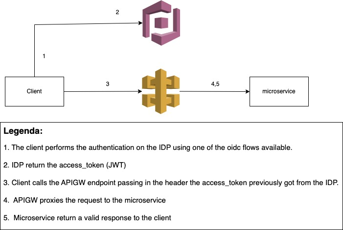

# Project micro-api-ecommerce

### Description
The project is a simple API for an e-commerce. The purpose of the project is to demonstrate BE skills.

### How it works
The application load in memory (sqlite) csv files products, users and the orders in the boostrap phase. 

The products are loaded from the file `items.csv`, users are loaded from the file `users.csv` and the orders from the file `orders.csv`. The file `orders_items_pivot.csv` defines the relation many to many for items and orders.

You can find openapi 3.0.0 specification on `/docs` route (the route is disabled in production mode).

You can find example files with relative schema in the mock_files folder.

### Environment variables
* MAE_API_PORT - port for the API - default 3000
* MAE_FILE_PATH - path to the file with data - default ./mock_files
* MAE_LOG_LEVEL - log level - default debug
* NODE_ENV - environment - default development

### Installation
1. Clone the repository
2. Run `npm i`
3. Run `npm start`
4. Open `http://localhost:3000/`

### Unit Testing
Run `npm test`

### Docker
1. Run `docker build -t micro-api-ecommerce .`
2. Run `docker run -it -p 3000:3000 micro-api-ecommerce -v ${PWD}/mock_files:/app/csv_files` - replace ${PWD}/mock_files with the path of csv_folder if you dont want to use the mock_files folder

### Authentication
Authentication has been excluded on purpose. Because in a microservice architecture the authentication is a common service and it is not the responsibility of the microservice to manage the authentication.

Below an example of the authentication architecture on AWS cloud provider. 

Basically we will use cognito as IDP and api gateway as the entry point for the microservice. The api gateway will manage the authentication and the authorization and will forward the request to the microservice.

